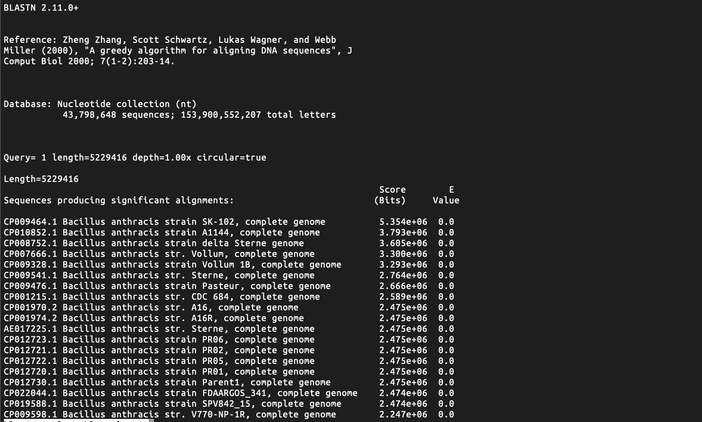
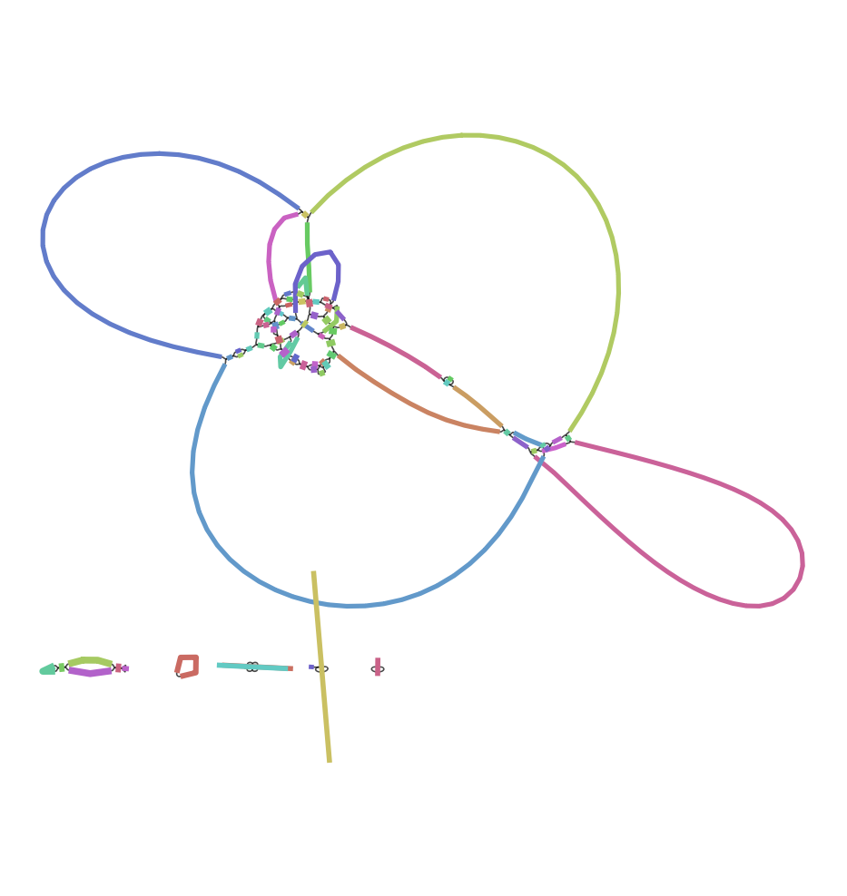
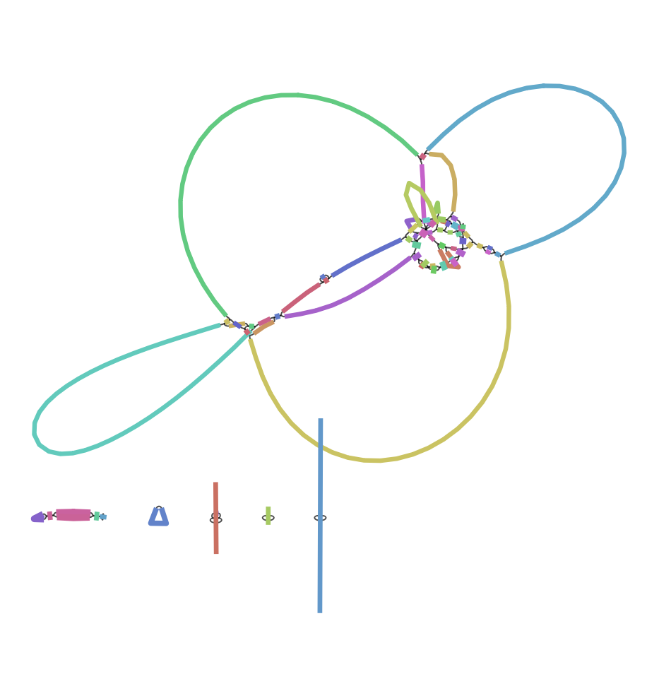
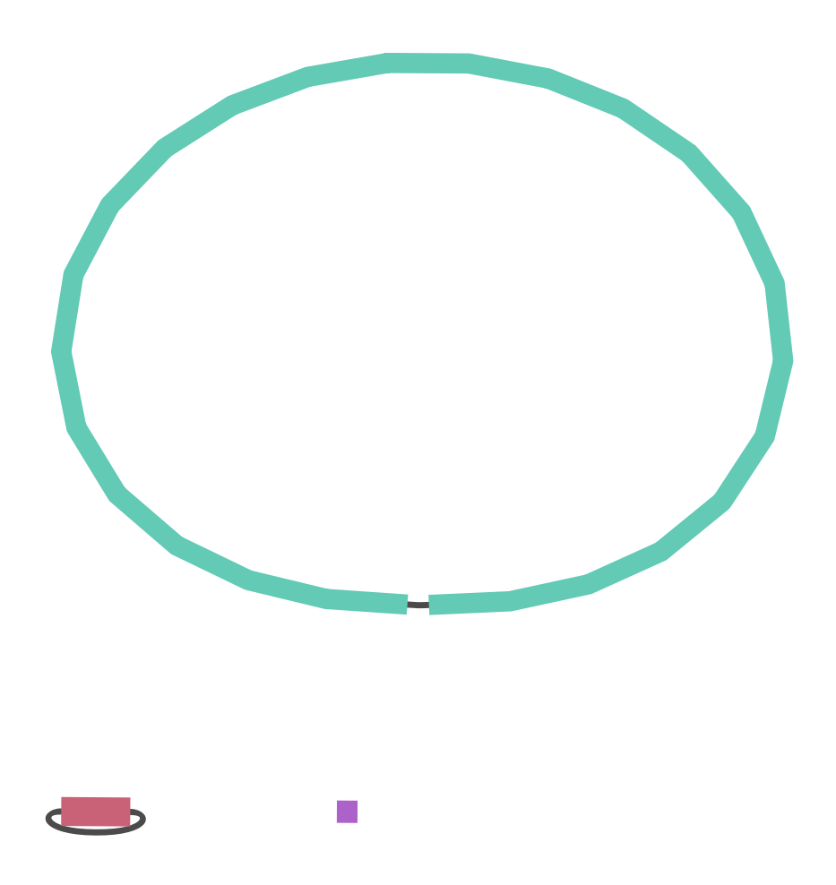
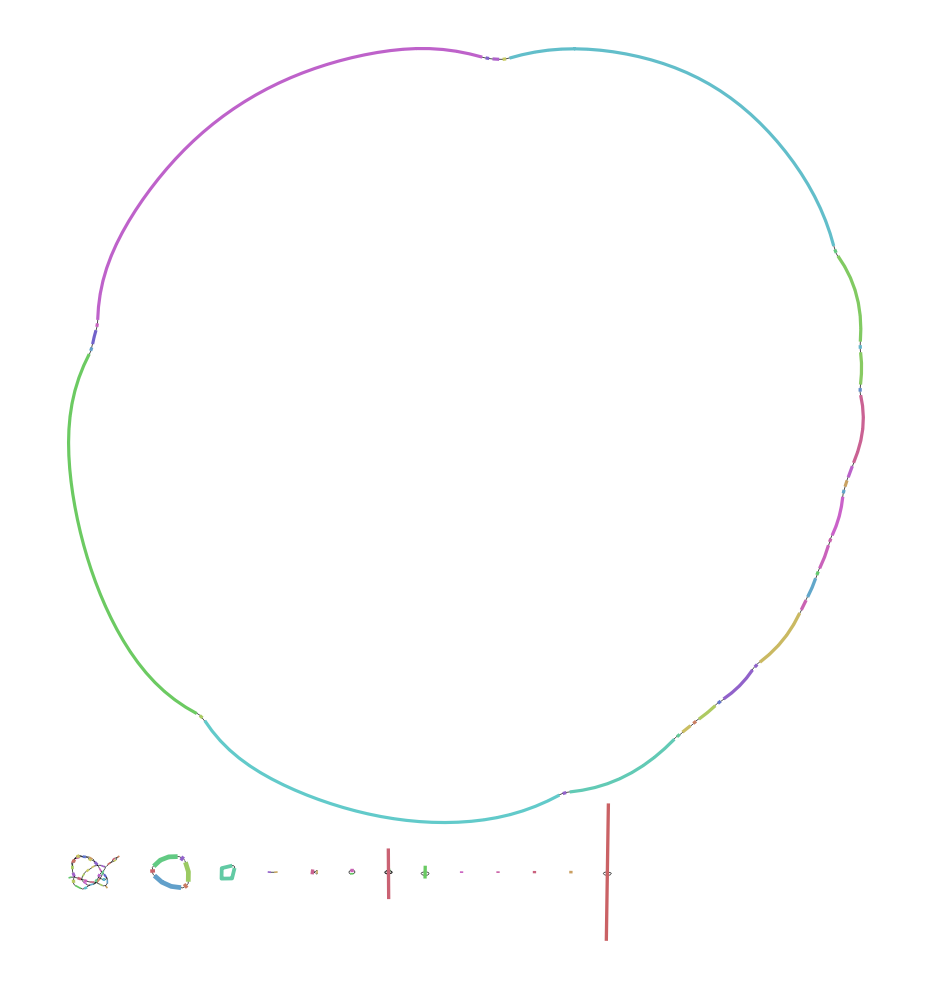
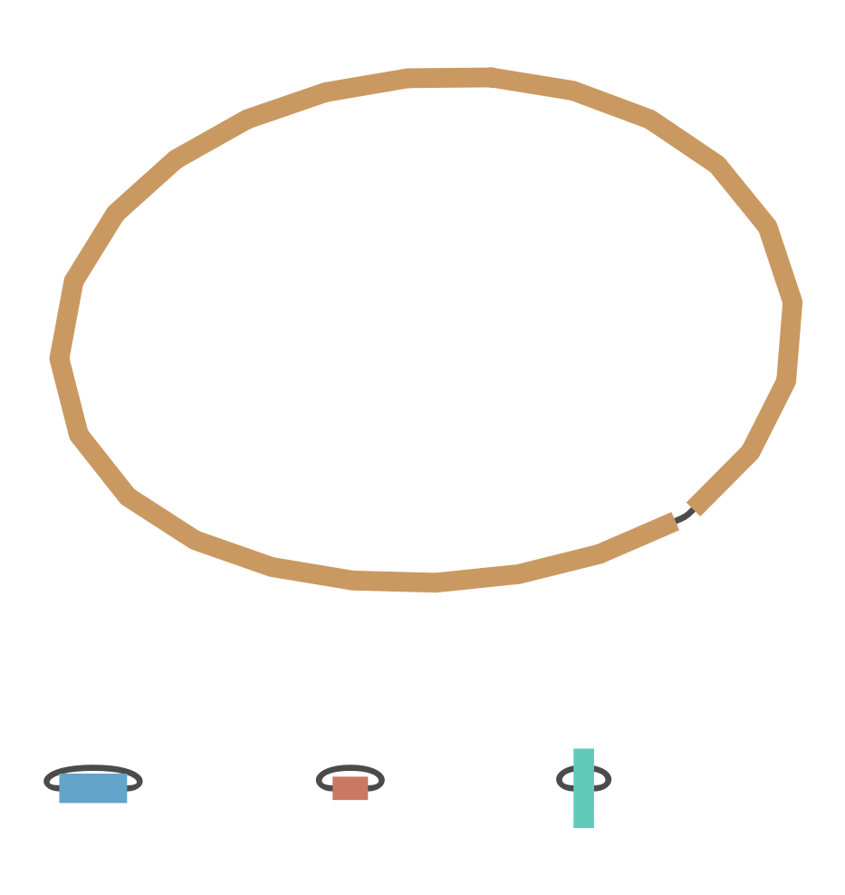
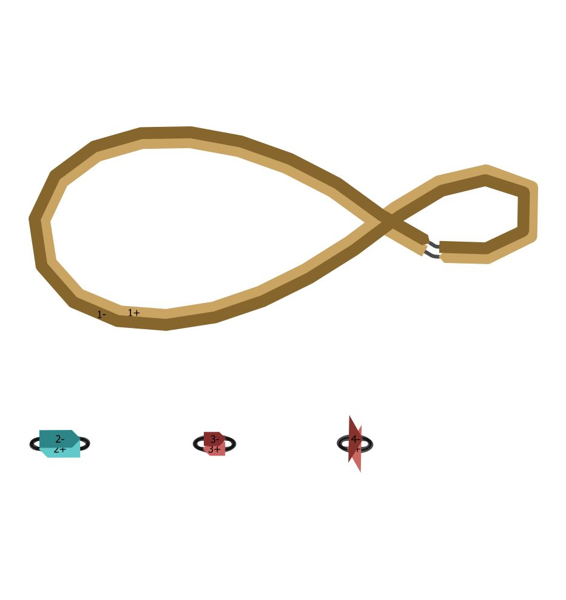
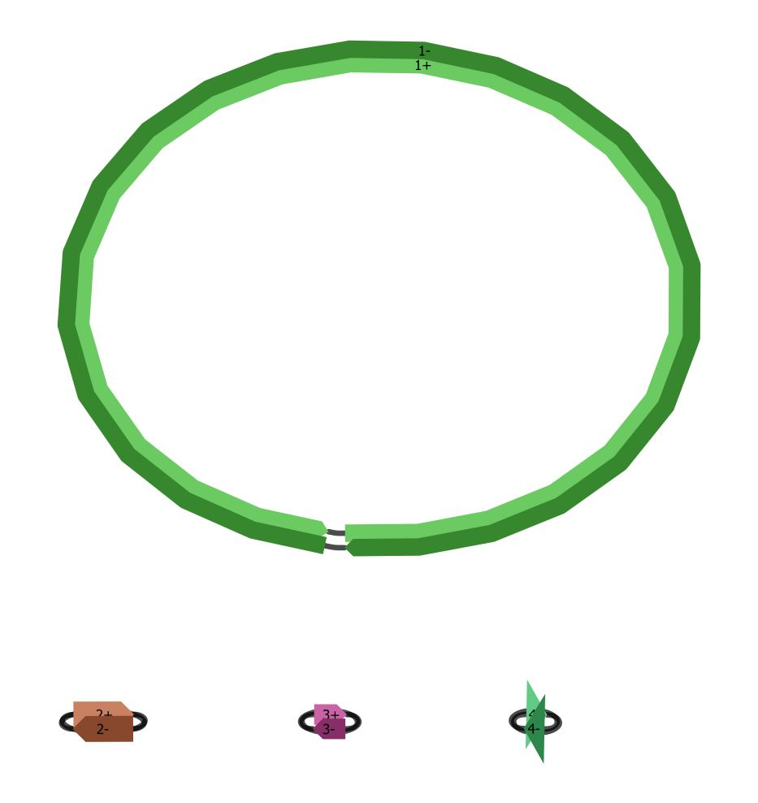

# Отчёт дз по nanopore АДБМ-2019 группа G3
Состав группы:  
* Мишина Елизавета Дмитриевна
* Растворова Анастасия Дмитриевна
* Рогова Полина Сергеевна
* Сивков Антон Александрович
### 1
Устанавливаем программы  
`conda install filtlong`  
`conda install unicycler`  

Загружаем файл с длинными ридами  
`fastq-dump SRR10088696`   
Загружаем и разделяем файл на два для парно-концевых прочтений. Данные Illumina  
`fastq-dump --split-files SRR9988362`  

### 2
Выбираем длинные прочтения. В качестве референсного генома используем данные Illumina. 
Минимальная длина 1000, 10% худших прочтений отбрасываются, сохраняем лучшие чтения 
до 400 млн. пар нуклеотидов.
```
filtlong -1 SRR9988362_1.fastq -2 SRR9988362_2.fastq --min_length 1000 --keep_percent 90 --target_bases 400000000 SRR10088696.fastq > output_long_reads.fastq
```
### 3
Делаем сборку в гибридном режиме. Используем короткие прочтения Illumina, и длинные прочтения, полученные
 на предыдущем этапе. С помощью флага -t задаем количество потоков.
```
unicycler -1 SRR9988362_1.fastq -2 SRR9988362_2.fastq -l output_long_reads.fastq -o output_dir -t 15
```
Результат сборки - файл assemly.fasta (в той же папке, что и этот отчёт)
### 4
blast запускался локально - для веб-версии слишком большая последовательность
  
Скорее всего бактерия принадлежит к одному из штаммов Bacillus anthracis -
возбудитель сибирской язвы  
Результат в файле blast_result_table_only.out

Графики, отображающие процесс сборки последовательности, представлены ниже. 
  
 
 
 
 
 
### 5
  
  
Судя по всему, собралось почти идеально в 1 большую и 3 маленьких плазмиды  
### 6
Написали небольшой скрипт, предварительно нужно установить abricate: `conda install -c conda-forge -c bioconda -c defaults abricate`
```
import subprocess
import tempfile
import argparse
import sys
import pandas as pd
from pathlib import Path

DATABASE_LIST = [
    'argannot',
    'card',
    'ecoh',
    'ncbi',
    'plasmidfinder',
    'resfinder',
    'vfdb'
]


if __name__ == '__main__':
    parser = argparse.ArgumentParser()
    parser.add_argument('--fasta-path', dest='fasta_path')
    parser.add_argument('--output-table', dest='output_table')
    args = parser.parse_args()
    fasta_path = args.fasta_path
    output_data = None
    with tempfile.TemporaryDirectory() as workdir:
        for database_name in DATABASE_LIST:
            target_path = Path(workdir, f'{database_name}.tsv')
            with target_path.open('w') as output_d:
                subprocess.run(
                    ['abricate', fasta_path, '--db', database_name], stdout=output_d, stderr=sys.stderr, check=True
                )
            database_result = pd.read_csv(target_path, sep='\t')
            if output_data is None:
                output_data = database_result
            else:
                output_data = output_data.append(database_result)
    output_data.to_csv(args.output_table, sep='\t', index=False)
```
Результаты работы скрипта:  

|#FILE         |SEQUENCE|START  |END    |GENE                            |COVERAGE   |COVERAGE_MAP   |GAPS |%COVERAGE|%IDENTITY|DATABASE     |ACCESSION                  |PRODUCT                                                                                                                                                                                                                 |
|--------------|--------|-------|-------|--------------------------------|-----------|---------------|-----|---------|---------|-------------|---------------------------|------------------------------------------------------------------------------------------------------------------------------------------------------------------------------------------------------------------------|
|assembly.fasta|1       |966256 |966843 |(Gly)VanZF-Pp                   |21-605/621 |========/======|1/3  |94.2     |83.33    |argannot     |AF155139:4339-4959         |(Gly)VanZF-Pp                                                                                                                                                                                                           |
|assembly.fasta|1       |2328592|2329521|(Bla)BLA-1                      |1-930/930  |===============|0/0  |100.0    |100.0    |argannot     |AY453161:501-1430          |(Bla)BLA-1                                                                                                                                                                                                              |
|assembly.fasta|1       |2355118|2356582|(MLS)LsaB                       |1-1465/1479|========/======|3/12 |98.65    |78.18    |argannot     |AJ579365:4150-5628         |(MLS)LsaB                                                                                                                                                                                                               |
|assembly.fasta|1       |4627533|4628231|(Gly)VanR-M                     |1-699/699  |========/======|2/2  |99.86    |75.43    |argannot     |FJ349556:982-1680          |(Gly)VanR-M                                                                                                                                                                                                             |
|assembly.fasta|1       |966256 |966843 |vanZF                           |21-605/622 |========/======|1/3  |94.05    |83.33    |card         |AF155139:4339-4960         |vanZF is a vanZ variant found in the vanF gene cluster                                                                                                                                                                  |
|assembly.fasta|1       |1495256|1496167|Bacillus_Cluster_A_intrinsic_mph|1-912/913  |===============|0/0  |99.89    |91.12    |card         |ACMJ01000036:72075-72987   |Bacillus Cluster A mph are chromosomally-encoded macrolide phosphotransferases that inactivate 14- and 15-membered macrolides such as erythromycin clarithromycin azithromycin.                                         |
|assembly.fasta|1       |1916505|1916920|FosB                            |1-416/417  |===============|0/0  |99.76    |87.5     |card         |NC_004722.1:1972252-1972669|A thiol transferase that leads to the resistance of fosfomycin. Contrasting FosA FosB is dependent on the cofactor Magnesium (II) and uses either bacillithiol or  L-cysteine to open up the epoxide ring of fosfomycin.|
|assembly.fasta|1       |2328592|2329521|BLA1                            |1-930/930  |===============|0/0  |100.0    |100.0    |card         |AY453161:501-1431          |Bla1 is a chromosomal-encoded beta-lactamase found in Bacillus anthracis which hydrolyzes penicillins.                                                                                                                  |
|assembly.fasta|1       |2355118|2356582|lsaB                            |1-1465/1480|========/======|3/12 |98.58    |78.18    |card         |NC_005076:4150-5629        |LsaB is an ABC efflux pump expressed in Staphylococcus sciuri. It confers resistance to clindamycin.                                                                                                                    |
|assembly.fasta|1       |3217368|3218138|Bla2                            |1-771/771  |===============|0/0  |100.0    |99.87    |card         |AY453162:501-1272          |Bla2 is a chromosomal-encoded beta-lactamase found in Bacillus anthracis which has penicillin cephalosporin and carbapenem-hydrolizing abilities.                                                                       |
|assembly.fasta|1       |4627533|4628231|vanRM                           |1-699/700  |========/======|2/2  |99.71    |75.43    |card         |FJ349556:982-1681          |vanRM is a vanR variant found in the vanM gene cluster                                                                                                                                                                  |
|assembly.fasta|1       |966256 |966843 |vanZ-F                          |21-605/621 |========/======|1/3  |94.2     |83.33    |ncbi         |A7J11_00543                |glycopeptide resistance protein VanZ-F                                                                                                                                                                                  |
|assembly.fasta|1       |1495256|1496167|mph(B)                          |1-912/912  |===============|0/0  |100.0    |91.12    |ncbi         |A7J11_05208                |Mph(B) family macrolide 2'-phosphotransferase                                                                                                                                                                           |
|assembly.fasta|1       |1916505|1916920|fosB                            |1-416/417  |===============|0/0  |99.76    |87.5     |ncbi         |A7J11_05167                |FosB/FosD family fosfomycin resistance bacillithiol transferase                                                                                                                                                         |
|assembly.fasta|1       |2328592|2329521|bla                             |1-930/930  |===============|0/0  |100.0    |100.0    |ncbi         |A7J11_05168                |class A beta-lactamase Bla1                                                                                                                                                                                             |
|assembly.fasta|1       |2355118|2356582|lsa(B)                          |1-1465/1479|========/======|3/12 |98.65    |78.18    |ncbi         |A7J11_01190                |ABC-F type ribosomal protection protein Lsa(B)                                                                                                                                                                          |
|assembly.fasta|1       |3217368|3218138|bla2                            |1-771/771  |===============|0/0  |100.0    |100.0    |ncbi         |A7J11_00039                |BcII family subclass B1 metallo-beta-lactamase                                                                                                                                                                          |
|assembly.fasta|1       |3778766|3779185|fosB2                           |1-420/420  |===============|0/0  |100.0    |100.0    |ncbi         |A7J11_00634                |fosfomycin resistance bacillithiol transferase FosB2                                                                                                                                                                    |
|assembly.fasta|1       |4627533|4628231|vanR                            |1-699/699  |========/======|2/2  |99.86    |75.43    |ncbi         |A7J11_02292                |VanM-type vancomycin resistance DNA-binding response regulator VanR                                                                                                                                                     |
|assembly.fasta|3       |1      |1539   |rep3_4_CDS38(pOX2)              |1-1539/1539|===============|0/0  |100.0    |100.0    |plasmidfinder|NC002146                   |rep3_4_CDS38(pOX2)_NC002146                                                                                                                                                                                             |
|assembly.fasta|1       |966256 |966843 |VanZ-F_1                        |21-605/621 |========/======|1/3  |94.2     |83.33    |resfinder    |AF155139                   |VanF vancomycin resistance operon (VanR-F VanS-F VanY-F and VanZ-F)                                                                                                                                                     |
|assembly.fasta|1       |1916505|1916920|fosB1_1                         |1-416/417  |===============|0/0  |99.76    |87.5     |resfinder    |CP001903                   |fosB1_1                                                                                                                                                                                                                 |
|assembly.fasta|1       |2355118|2356582|lsa(B)_1                        |1-1465/1479|========/======|3/12 |98.65    |78.18    |resfinder    |AJ579365                   |lsa(B)_1                                                                                                                                                                                                                |
|assembly.fasta|1       |3778766|3779185|fosB2_1                         |1-420/420  |===============|0/0  |100.0    |100.0    |resfinder    |AE016879                   |fosB2_1                                                                                                                                                                                                                 |
|assembly.fasta|1       |4627533|4628231|VanR-M_1                        |1-699/699  |========/======|2/2  |99.86    |75.43    |resfinder    |FJ349556                   |VanM vancomycin resistance operon (VanM VanH-M VanR-M VanS-M VanX-M and VanY-M)                                                                                                                                         |
|assembly.fasta|1       |89283  |91270  |clpC                            |1-1982/2463|========/====..|11/26|80.06    |75.63    |vfdb         |NP_463763                  |(clpC) endopeptidase Clp ATP-binding chain C [ClpC (VF0072)] [Listeria monocytogenes EGD-e]                                                                                                                             |
|assembly.fasta|1       |689495 |691894 |inhA                            |1-2400/2400|===============|0/0  |100.0    |100.0    |vfdb         |YP_026915                  |(inhA) immune inhibitor A metalloprotease [InhA (VF0536)] [Bacillus anthracis str. Sterne]                                                                                                                              |
|assembly.fasta|1       |1770777|1771937|nheA                            |1-1161/1161|===============|0/0  |100.0    |95.78    |vfdb         |NP_978284                  |(nheA) non-hemolytic enterotoxin A [Nhe (VF0533)] [Bacillus cereus ATCC 10987]                                                                                                                                          |
|assembly.fasta|1       |1771969|1773177|nheB                            |1-1209/1209|===============|0/0  |100.0    |95.62    |vfdb         |NP_978285                  |(nheB) non-hemolytic enterotoxin B [Nhe (VF0533)] [Bacillus cereus ATCC 10987]                                                                                                                                          |
|assembly.fasta|1       |1773285|1774364|nheC                            |1-1080/1080|===============|0/0  |100.0    |92.69    |vfdb         |NP_978286                  |(nheC) non-hemolytic enterotoxin C [Nhe (VF0533)] [Bacillus cereus ATCC 10987]                                                                                                                                          |
|assembly.fasta|1       |3086828|3088366|BAS3109                         |1-1539/1539|===============|0/0  |100.0    |99.94    |vfdb         |YP_029366                  |(BAS3109) thiol-activated cytolysin [ALO (VF0534)] [Bacillus anthracis str. Sterne]                                                                                                                                     |
|assembly.fasta|1       |4679204|4679410|hasC                            |1-207/915  |====...........|0/0  |22.62    |76.33    |vfdb         |NP_270109                  |(hasC) UDP-glucose pyrophosphorylase [Hyaluronic acid capsule (VF0244)] [Streptococcus pyogenes M1 GAS]                                                                                                                 |
|assembly.fasta|2       |146340 |148769 |lef                             |1-2430/2430|===============|0/0  |100.0    |99.96    |vfdb         |AAD32411                   |(lef) anthrax toxin lethal factor precursor [Anthrax toxin (VF0142)] [Bacillus anthracis str. Sterne]                                                                                                                   |
|assembly.fasta|2       |152062 |154356 |pagA                            |1-2295/2295|===============|0/0  |100.0    |99.87    |vfdb         |AAD32414                   |(pagA) anthrax toxin moiety protective antigen [Anthrax toxin (VF0142)] [Bacillus anthracis str. Sterne]                                                                                                                |
|assembly.fasta|2       |173119 |175521 |cya                             |1-2403/2403|===============|0/0  |100.0    |99.96    |vfdb         |AAD32426                   |(cya) calmodulin sensitive adenylate cyclase edema factor [Anthrax toxin (VF0142)] [Bacillus anthracis str. Sterne]                                                                                                     |
|assembly.fasta|3       |71524  |72918  |capB                            |1-1395/1395|===============|0/0  |100.0    |100.0    |vfdb         |AAF13663                   |(capB) CapB involved in Poly-gamma-glutamate synthesis [Capsule (VF0141)] [Bacillus anthracis]                                                                                                                          |
|assembly.fasta|3       |72933  |73382  |capC                            |1-450/450  |===============|0/0  |100.0    |100.0    |vfdb         |AAF13662                   |(capC) CapC involved in Poly-gamma-glutamate synthesis [Capsule (VF0141)] [Bacillus anthracis]                                                                                                                          |
|assembly.fasta|3       |73394  |74629  |capA                            |1-1236/1236|===============|0/0  |100.0    |100.0    |vfdb         |AAF13661                   |(capA) CapA required for Poly-gamma-glutamate transport [Capsule (VF0141)] [Bacillus anthracis]                                                                                                                         |
|assembly.fasta|3       |74812  |76212  |dep/capD                        |1-1401/1401|===============|0/0  |100.0    |99.93    |vfdb         |AAF13660                   |(dep/capD) gamma-glutamyltranspeptidase required for polyglutamate anchoring to peptidoglycan [Capsule (VF0141)] [Bacillus anthracis]                                                                                   |
|assembly.fasta|3       |76227  |76370  |capE                            |1-144/144  |===============|0/0  |100.0    |100.0    |vfdb         |YP_016572                  |(capE) CapE involved in Poly-gamma-glutamate synthesis [Capsule (VF0141)] [Bacillus anthracis str. Ames Ancestor]                                                                                                       |

Нашлось 40 генов, довольно много на третьем плазмиде (относительно его размера), 
может быть эти гены это результат горизонтального переноса.


